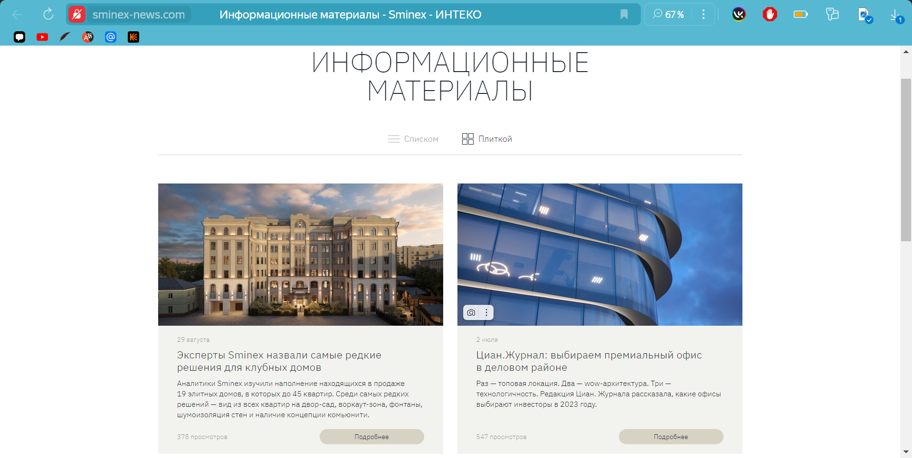
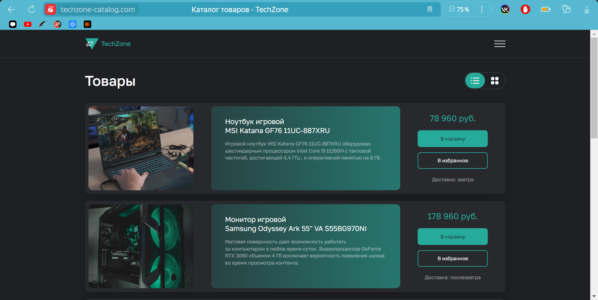

# Лабораторная 1. 

## Требования к настройке nginx:
1. Работает по https c сертификатом.
2. Настроено принудительное перенаправление HTTP-запросов (порт 80) на HTTPS (порт 443) для обеспечения безопасного соединения.
3. Использован alias для создания псевдонимов путей к файлам или каталогам на сервере.
4. Настроены виртуальные хосты для обслуживания нескольких доменных имен на одном сервере.

## Результат: 
Предположим, что у вас есть два пет проекта на одном сервере, которые должны быть доступны по https. Настроенный вами веб сервер умеет работать по https, относить нужный запрос к нужному проекту, переопределять пути исходя из требований пет проектов.

## Ход работы:

Был установлен веб-сервер nginx версии 1.26.2, последней на данный момент. Для этого был скачан и извлечён архив с программой.

### Самоподписанные сертификаты OpenSSL
Далее были сгенерированы самоподписанные сертификаты с помощью программы OpenSSL. Так как программа уже была установлена на данный ПК, то настривать её не пришлось. Для удобства в папке с извлечённым архивом была создна папка ssl. Для создания серфиката и ключа было достаточно перейти в данную папку с помощью командной строки и задать следующую команду:
```
openssl req -x509 -sha256 -nodes -days 365 -newkey rsa:2048 -keyout privateKey.key -out certificate.crt
```
где:
- x509 — уточнение, что нужен именно самоподписанный сертификат;
- newkey — автоматическое создание ключа сертификата;
- days — срок действия сертификата в днях;
- keyout — путь (если указан) и имя файла ключа;
- out —  путь (если указан) и имя файла сертификата.

Далее были введены требуемые от нас код страны, её название, город, название компании,
название отдела, FQDN сервера или имя и адрес электронной почты ~~(которые нигде не пригодились)~~. В итоге, теперь в папке ssl есть privateKey.key в качестве ключа и certificate.crt — сертификата. Чтобы защитить сертификатом виртуальные хосты, были написаны следующие строки: 
```
server {
  listen              443 ssl;
  server_name         [domain.com];

  ssl_certificate     C:/tryn/nginx-1.26.2/ssl/certificate.crt; 
  ssl_certificate_key C:/tryn/nginx-1.26.2/ssl/privateKey.key;
}
```
где:
- listen: через какой порт будет прослушиваться трафик;
- server_name: имя домена;
- ssl_certificate: путь до созданного файла с сертификатом;
- ssl_certificate_key: путь до файла с приватным ключом.

### Перенаправление HTTP-запросов на HTTPS
  
Следующим был настроен редирект с незашифрованного веб-трафика HTTP на зашифрованный HTTPS. Для этого в файле конфигурации Nginx было написаны следующие команды:
```
server {
  listen        80;
  server_name   sminex-news.com techzone-catalog.com;
  return 301    https://$host$request_uri;
}
```
где:
- listen 80: через какой порт система будет перехватывать весь HTTP-трафик;
- server_name: имена необходимых доменов;
- return 301: показатель постоянного перенаправления;
- https://$host$request_uri: указание версии HTTPS того, что набрал пользователь.

### Псведонимы alias

Последним был использован alias для создания псевдонимов путей к папке со стилями к проектам. Для этого достаточно ввести, например, следующее:
```
location /css {
  alias C:/tryn/nginx-1.26.2/html/techzone-catalog.com/css;
}	
```
### Результаты

Итоговый конфигурационный файл выглядит следующим образом:
```
http {
  server {
    listen        80;
    server_name   sminex-news.com techzone-catalog.com;
    return 301    https://$host$request_uri;
  }

  server {
    listen        443 ssl;
    server_name   sminex-news.com;

    ssl_certificate       C:/tryn/nginx-1.26.2/ssl/certificate.crt;
    ssl_certificate_key   C:/tryn/nginx-1.26.2/ssl/privateKey.key;

  location / {
    root   C:/tryn/nginx-1.26.2/html/sminex-news.com;
    index  index.html;
  }

  location /css {
    alias C:/tryn/nginx-1.26.2/html/sminex-news.com/css;
    }
  }

  server {
    listen       443 ssl;
    server_name  techzone-catalog.com;

    ssl_certificate       C:/tryn/nginx-1.26.2/ssl/certificate.crt;
    ssl_certificate_key   C:/tryn/nginx-1.26.2/ssl/privateKey.key;

    location / {
      root   C:/tryn/nginx-1.26.2/html/techzone-catalog.com;
      index  index.html;
    }

    location /css {
      alias C:/tryn/nginx-1.26.2/html/techzone-catalog.com/css;
    }
  }
}
```

Теперь, если ввести sminex-news.com в браузер, можно увидеть, что происходит перенаправление с http на https и сайт отображается как надо:


Аналогично и со вторым доменом techzone-catalog.com:



Ура ура :)

# Лабораторная 1. Со звёздочкой

## Цель
Необходимо проверить на уязвимости (минимум 3) nginx другой команды, например, path traversal, перебор страниц через ffuf и/или любые другие на ваш выбор. Взлом считается успешным, если вы попали туда, куда не планировалось попадать пользователю, даже если там ничего нет. Успешность взлома не влияет на оценку лаб обеих команд. 

## Ход работы
### Заголовки безопасности
Настройка заголовков безопасности в nginx является необходимой для повышения безопасности сайта. Заголовки безопасности защищают против различного вида атак, таких как, cross site scripting (межсайтовый скриптинг, XSS), clickjacking (захват клика) и других. Они говорят браузеру, как работать с контентом на странице, создавая дополнительный уровень безопасности. Ниже представлены некоторые из них:

*X-XSS-Protection*: заголовок, который обеспечивает запрет выполнения встроенного JavaScript-кода в браузерах без поддержки политики безопасности контента (Content Security Policy). Для настройки заголовка в конфигурационный файл необходимо добавить следующее:

```add_header X-XSS-Protection "1; mode=block";```

*HTTP Strict Transport Security*: для сайтов, работающих по протоколу HTTPS, рекомендуется указывать заголовок ответа HSTS для принудительного перенаправления страниц с HTTP на HTTPS. Для настройки заголовка в конфигурационный файл необходимо добавить следующее:

```add_header Strict-Transport-Security 'max-age=31536000; includeSubDomains; preload';```

*X-Content-Type-Options*: отправка заголовка ответа со значением nosniff не позволит браузеру анализировать MIME ответ, отличный от объявленного типа содержимого. Директива nosniff применяется только к типам script и style. Для настройки заголовка в конфигурационный файл необходимо добавить следующее:

```aadd_header X-Content-Type-Options nosniff;```

В представленном командой конфигурационном файле не было добавлено никаких заголовков безопасности, соотвественно, он может быть уязвим к атакам.

### Path Traversal 
Уязвимость обхода пути (Path Traversal) позволяет злоумышленникам обходить приложение для доступа к ограниченным файлам/каталогам сервера. Используя эту уязвимость, злоумышленник может получить доступ к коду, учетным данным внутренних серверов, файлам/библиотекам операционной системы и т.д. В OWASP Top 10 2022 данная уязвимость входит в раздел A1: Broken Access Control. 94 процента веб-приложений в той или иной форме имеют нарушенный контроль доступа, как отмечает OWASP.

Данная проблема проявляется только в конфигурациях с директивой "alias", размещённой внутри блока "location", параметр которой не завершается на символ "/". Директива alias должна быть указана внутри location и должна заканчиваться косой чертой. В представленном конфигурационном файле как раз можно наблюдать неправильно сконфигурированный alias:

```
#неправильно
location /styles {
  alias D:/nginx-1.27.2/html/styles;  
}

#правильно
location /styles/ {
  alias D:/nginx-1.27.2/html/styles;  
}
```
### SSL/TLS настройки

По умолчанию nginx может использовать устаревшие SSL/TLS-протоколы. Сейчас протоколы версии ниже, чем TLS 1.2 или 1.3, считаются небезопасными, так как подвержены атаке Poodle. Расшифровается как Padding Oracle (лазейка в безопасности некоторых систем, использующих шифрование) On Downgraded (когда зашифрованное соединение между Вашим устройством и веб-сайтом или сервисом становится менее безопасным) Legacy Encryption (старые, устаревшие методы шифрования данных). Иными словами, это атака на старые версии SSL, которые являются менее защищёнными, позволяющая украсть и расшифровать конфиденциальные данные.

Для предотвращения атаки стоит задать в конфиге nginx версию TLS не ниже 1.2:

```ssl_protocols TLSv1.2 TLSv1.3;```

Также стоит отключить слабые или устаревшие комплекты шифрования. Они могут привести к уязвимости, например, к перебою и поэтому нужно разрешить только надёжный шифр. Рекомендуемый набор шифров:

```ssl_ciphers ECDHE-RSA-AES256-GCM-SHA512:DHE-RSA-AES256-GCM-SHA512:ECDHE-RSA-AES256-GCM-SHA384:DHE-RSA-AES256-GCM-SHA384:ECDHE-RSA-AES256-SHA384;```

Чтобы разрешить использование только указанных нами шифров, необходимо записать:
```
ssl_prefer_server_ciphers on;
ssl_session_cache shared:SSL:10m;
```

Порядок в строке ssl_ciphers имеет значение: чем ближе он к началу, тем выше его приоритет. Если на клиенте не окажется шифров, разрешённых на сервере, последний закроет с ним соединение.

## Вывод:
В данной лабораторной работе был настроен nginx сервер на операционной системе Windows, содержащий два виртульных хоста, с использованием сертификатов SSL, редиректром http-запросов на https, а также псевдонимов alias. Во второй части лабораторной работы были рассмотрены и устранены уязвимости, связанные с безопасными заголовками, path traversal, а также SSL/TLS протоколами.

## Список полезных источников
1. https://levashove.ru/install-nginx-server-windows
2. https://trueconf.ru/blog/baza-znaniy/kak-sgenerirovat-samopodpisannyj-sertifikat
3. https://wiki.merionet.ru/articles/kak-nastroit-redirekt-s-http-na-https-v-nginx
4. https://www.youtube.com/watch?v=yjZPP-wQZlo&t=8s&ab_channel=RyudithTutorial
5. https://www.youtube.com/watch?v=8P2r0xSXk28&ab_channel=TonyTeachesTech
6. https://linuxcapable.com/how-to-configure-security-headers-in-nginx/
7. https://blog.dubkov.org/learn/secure/security-headers-for-nginx/
8. https://habr.com/ru/articles/745718/
9. https://www.easycoding.org/2015/01/19/usilivaem-bezopasnost-https-v-nginx.html
10. https://raymii.org/s/tutorials/Strong_SSL_Security_On_nginx.html
11. https://www.ssldragon.com/ru/blog/what-is-poodle-attack-ssl/
