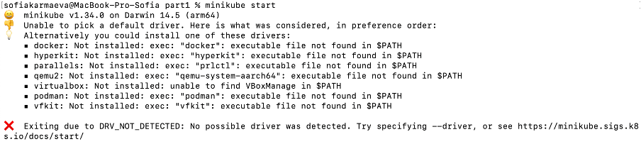

# Лабораторная работа №3

## Базовое задание

Поднять kubernetes кластер локально (minikube), в нём развернуть сервис, используя 2-3 ресурса kubernetes. Показать работоспособность сервиса.
Прочитать [шикарную книжку про жирафа](https://drive.google.com/file/d/1Sm3EslfGtSaKZCZwnZ_8BZGmFiPC13Qp/view?usp=sharing)

## Выполнение задания

Сначала был скачан minikube с помощью команды 'brew install minikube'.


Был клонирован репозиторий, а также создана папка проекта.


Были созданы ресурсы проекта: Deployment, Service, ConfigMap. Ниже будет приведено содержание данных файлов.



Файл `html-page-config.yaml`:

```
apiVersion: v1
kind: ConfigMap
metadata: 
  name: html-page-config
data:
  index.html: |
    <html>
      <head>Page</head>
      <body>
        <h1>The work is completed successfully</h1>
      </body>
    </html>
```

Здесь под тегом `data` был указан файл `index.html` с html-кодом (приписан после `|`) страницы, которая станет доступна при развёртывании сервиса. 

Файл `service.yaml`:

```
apiVersion: v1
kind: Service
metadata: 
  name: service
spec:
  type: NodePort
  selector:
    app: html-page
  ports:
    - port: 80
      targetPort: 80
      nodePort: 30003
```

Здесь в тегах `spec -> ports -> port, targetPort` было указано использовать 80 порт для доступа к сервису - доступ к html-странице по протоколу `http`. Для доступа снаружи был выбран `nodePort` равный 30003.

Файл `deployment.yaml`:

```
apiVersion: apps/v1
kind: Deployment
metadata: 
  name: html-page-deployment
spec:
  replicas: 1
  selector: 
    matchLabels:
      app: html-page
  template: 
    metadata:
      labels:
        app: html-page
    spec: 
      containers:
      - name: nginx
        image: nginx:1.26.2
        ports:
        - containerPort: 80
        volumeMounts: 
        - name: html-volume
          mountPath: /usr/share/nginx/html
      volumes:
      - name: html-volume
        configMap: 
          name: html-page-config
```

Здесь в тегах `spec -> template -> spec -> containers, volumes` было указано использовать контейнер `nginx` для запуска html-страницы, которая доступна в `configMap`. Для контейнера было также указано использовать 80 порт. 

После чего был (не) запущен minikube.


Чтобы всё-таки его запустить был скачан Docker.


Затем была проведена проверка установки Docker'а, и был запущен minikube.


После чего были развёрнуты ConfigMap, Deployment и Service. 


Для открытия страницы сервиса был получен его адрес. При этом доступ к странице осуществляется не по ip-адресу `minikube` и указаному в `service.yaml` порту (`nodePort`), а через `localhost` и случайный порт, который выбрал `minikube`. Это произошло, потому что `minikube` автоматически настраивает проксирование для сервисов с типом `NodePort`.


При переходе по полученному адресу открылась html-страница, написанная в ConfigMap'е. 


Если затем сделать в терминале control+C


то страница пропадёт.


