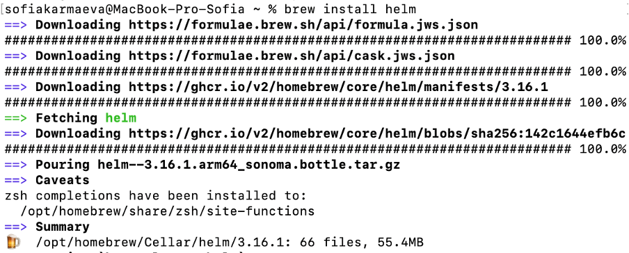
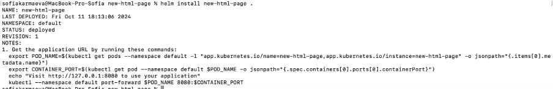
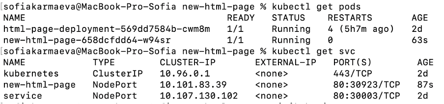
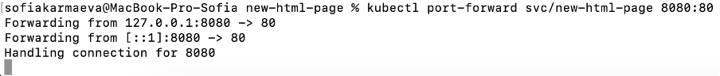
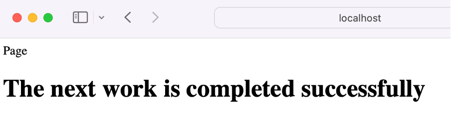
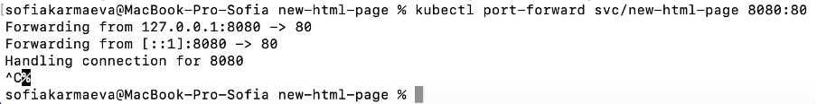
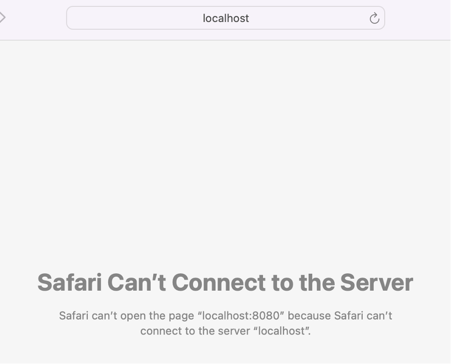
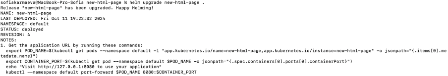
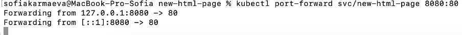

# Лабораторная работа №3

## Задание со звёздочкой

Создать `helm chart` на основе базовой лабы. Задеплоить его в кластер. Поменять что-то в сервисе, задеплоить новую версию при помощи апгрейда релиза. 
Привести 3 причины, по которым использовать `helm` удобнее, чем классический деплой через `kubernetes манифесты`.

## Выполнение задания

Сначала был скачан `helm`. 



После перехода в нужную директорию был создан `helm chart`. 


В папке `new-html-page/templates` были изменены файлы `deployment.yaml`, `service.yaml`, а также создан файл `configmap.yaml`. Ниже будет приведено итоговое содержание данных файлов.

Файл `deployment.yaml`:

```
apiVersion: apps/v1
kind: Deployment
metadata:
  name: {{ .Release.Name }}
  labels:
    app: {{ .Release.Name }}
spec:
  replicas: 1
  selector:
    matchLabels:
      app: {{ .Release.Name }}
  template:
    metadata:
      labels:
        app: {{ .Release.Name }}
    spec:
      containers:
        - name: nginx
          image: nginx:1.26.2
          ports:
            - containerPort: 80
          volumeMounts:
            - name: html-volume
              mountPath: /usr/share/nginx/html
      volumes:
        - name: html-volume
          configMap:
            name: {{ .Release.Name }}-configmap
```

Здесь в тегах `spec -> template -> spec -> containers, volumes` было указано использовать контейнер `nginx` для запуска html-страницы, которая доступна в `configMap`. Для контейнера было указано использовать 80 порт. 

Файл `service.yaml`:

```
apiVersion: v1
kind: Service
metadata:
  name: {{ .Release.Name }}
spec:
  type: ClusterIP
  ports:
    - port: 80
      targetPort: 80
  selector:
    app: {{ .Release.Name }}
```

Здесь в тегах `spec -> ports -> port, targetPort` было указано использовать 80 порт для доступа к сервису - доступ к html-странице по протоколу `http`.

Файл `configmap.yaml`:

```
apiVersion: v1
kind: ConfigMap
metadata:
  name: {{ .Release.Name }}-configmap
data:
  index.html: |
    <html>
      <head>Page</head>
      <body>
        <h1>The next work is completed successfully</h1>
      </body>
    </html>
```

Здесь под тегом `data` был указан файл `index.html` с html-кодом (приписан после `|`) страницы, которая станет доступна при развёртывании сервиса. 

Во всех ресурсах в качестве имени приложения вставляется название релиза: `{{ .Release.Name }}`.

Затем созданный `helm chart` был задеплоин в кластер.



Также были проверены статусы пода и сервиса.



Так как в `service.yaml` был указан тип сервиса `ClusterIP`, для доступа к сервису было использовано перенаправление портов.



После чего при переходе на страницу `127.0.0.1:8080` была получена html-страница.



Если затем сделать в терминале control+C



то страница пропадёт.



Затем в файл `configmap.yaml` были внесены изменения:

```
apiVersion: v1
kind: ConfigMap
metadata:
  name: {{ .Release.Name }}-configmap
data:
  index.html: |
    <html>
      <head>Page</head>
      <body>
        <h1>The last work is completed successfully</h1>
      </body>
    </html>
```

После чего был произведён апгрейд релиза.



Для доступа к сервису было вновь использовано перенаправление портов.



После чего при переходе на страницу `127.0.0.1:8080` была получена новая html-страница.


> Причины, по которым использовать `helm` удобнее, чем классический деплой через `kubernetes манифесты`:
>
> 1. Шаблонизация. Пишутся шаблоны ресурсов со значениями-переменными, фактические значения которых берутся из специального файла. Таким образом, можно скопировать один шаблон во множество проектов, и в каждом изменять значения переменных под требования к проекту. 
> 2. Управление релизами. Благодаря командам `install` (развернуть/установить), `uninstall` (удалить), `upgrade` (обновить) и `rollback` (откатить) упрощается процесс управления релизами. 
> 3. Изоляция конфигураций. Параметры конфигураций хранятся отдельно от самих манифестов (в файле `values.yaml`), что упрощает процесс настройки релиза (не надо изменять значения параметров в файлах ресурсов). 
